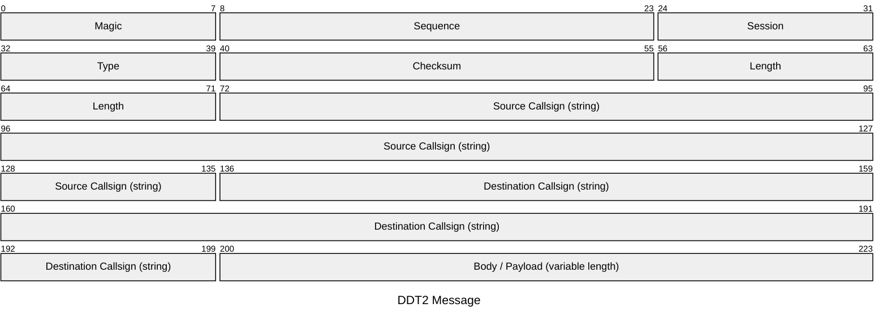
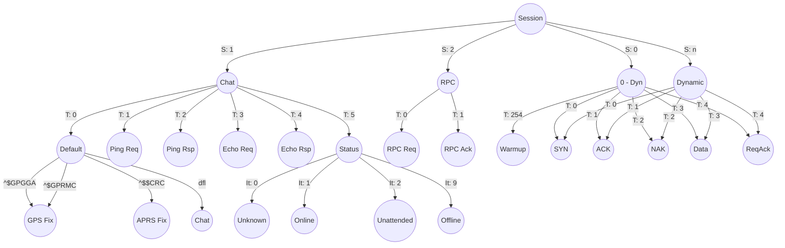

# D-Rats Data Transport version 2

> [!WARNING]
> This document IS NOT a specification, rather a scratchbook which details how messages are encoded.

## Message yEncoding
Prior to being sent, the messages are yEncoded with the following parameters:
  * Begin marker: `[SOB]`
  * End marker: `[SOB]`
  * Escape character: `=` (`0x3D`)
  * Forbidden characters: `0x00`, `0x11`, `0x13`, `0x1A`, `0xFD`, `0xFE`, `0xFF`
  * Offset: 64

## Message formatting

All fields, unless explicitely stated, are unsigned integers in the network order.

The `Magic` field holds either of the following value:
  * `0x22` if the body / payload is not compressed.
  * `0xDD` if the body / payload is compressed using the DEFLATE algorithm.

The `Checksum` is computed using the CRC16-CCITT algorithm on the full message, with the checksum bytes set to `0x0000`. 

## How to classify packets

In the following graph:
  * `S` refers to the Session field value in the header
  * `T` refers to the Type field value in the header
  * `It` refers to the Inner Type (first byte of the body, once uncompressed, if applicable).

