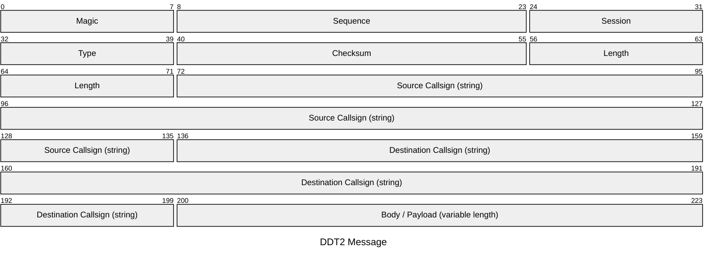
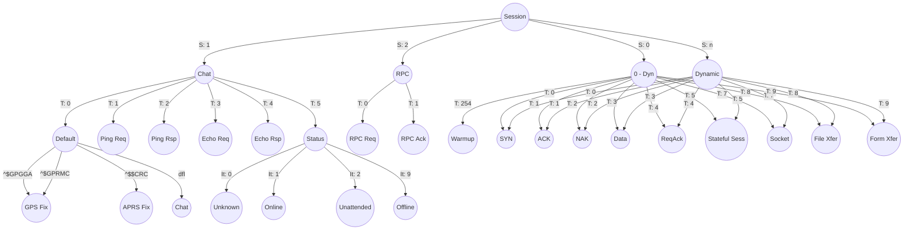
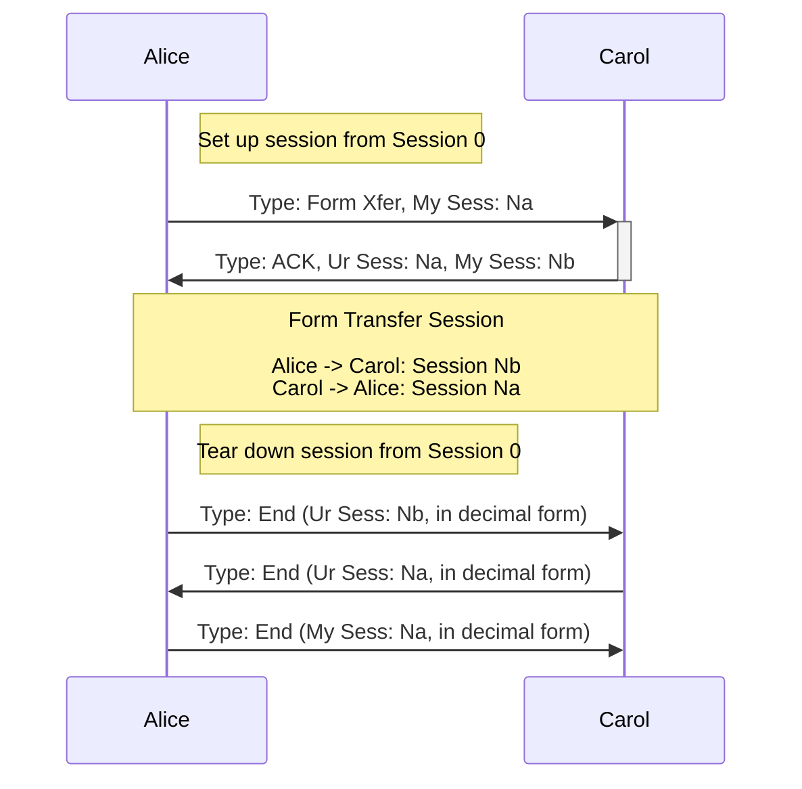
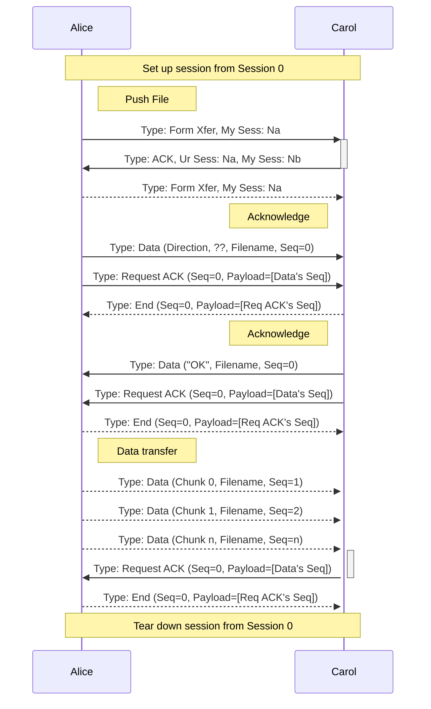

# D-Rats Data Transport version 2

> [!WARNING]
> This document IS NOT a specification, rather a scratchbook which details how messages are encoded.

## Message yEncoding
Prior to being sent, the messages are yEncoded with the following parameters:
  * Begin marker: `[SOB]`
  * End marker: `[SOB]`
  * Escape character: `=` (`0x3D`)
  * Forbidden characters: `0x00`, `0x11`, `0x13`, `0x1A`, `0xFD`, `0xFE`, `0xFF`
  * Offset: 64

Per D-Star specification, section 6.2:
> データフレームが “0xE7, 0x84, 0x76” のデータ列となり、かつ音声フレームが無音 パターン“0x9E, 0x8D,
0x32, 0x88, 0x26, 0x1A, 0x3F, 0x61, 0xE8”の場合にパケッ トロスとして扱うため使用できません。

Best way to ensure we don't trigger packet loss mechanisms would be to also escape `0xE7`, as recommended in said subsection, I'll file a PR on this.

## Message formatting

  * Once yDecoded, a D-Rats packet is organised as described below.
  * All fields, unless explicitely stated, are unsigned integers in the network order.
  * Strings are fixed-size, not null-terminated.
  * Presence of a body / payload is optional (FIXME: confirm this reading back d-rats' code)
  * The field sizes, in the following graph are given in **bits**, not **bytes** for readability.



The `Magic` field holds either of the following value:
  * `0x22` if the body / payload is not compressed.
  * `0xDD` if the body / payload is compressed using the DEFLATE algorithm.

The `Checksum` is computed using the CRC16-CCITT algorithm on the full message, with the checksum bytes set to `0x0000`. 

## How to classify message payload

In the following graph:
  * `S` refers to the Session field value in the header
  * `T` refers to the Type field value in the header
  * `It` refers to the Inner Type (ASCII decimal value of the first byte of the body, once uncompressed, if applicable).



## Dynamic session ID:

In control.py, derived from stateful

```python
T_PNG = 0
T_END = 1
T_ACK = 2
T_NEW = 3

T_NEW + base.T_GENERAL  : stateful.StatefulSession,
T_NEW + base.T_FILEXFER : file.FileTransferSession,
T_NEW + base.T_FORMXFER : form.FormTransferSession,
T_NEW + base.T_SOCKET   : sock.SocketSession,
```
In base:
```
T_STATELESS = 0
T_GENERAL = 1
T_UNUSED2 = 2 # Old non-pipelined FileTransfer
T_UNUSED3 = 3 # Old non-pipelined FormTransfer
T_SOCKET = 4
T_FILEXFER = 5
T_FORMXFER = 6
T_RPC = 7
```

Stateful session: 4
Pipelined File transfer: 8
Pipelined Form transfer: 9
Socket session: 7

## Stateful session management



## Form Transfer

